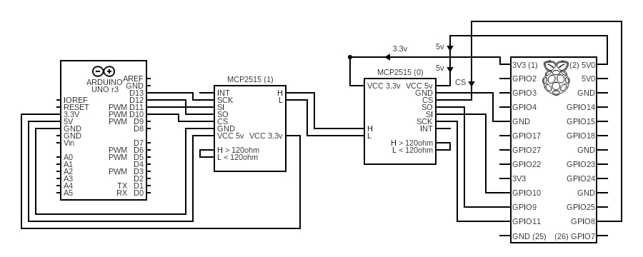

# Setup the canbus for Raspberry PI 4 + mcp2515
Frist steps to install:

sudo apt update && sudo apt upgrade
sudo apt install can-utils
sudo apt-get install g++ make

## Change config.txt
sudo nano /boot/config.txt

THEN MAKE SURE THESE LINES ARE PRESENT & NOT COMMENTED:

dtparam=spi=on

dtoverlay=mcp2515-can0,oscillator=16000000,interrupt=25

## Reboot
sudo reboot

## After reboot (TODO: Setup automaticly at boot)
sudo modprobe can
sudo modprobe can-dev
sudo modprobe can-raw
sudo modprobe mcp251x

sudo ip link set can0 type can bitrate 125000 loopback off
sudo ip link set up can0

CHECK if Can0 is active:
ifconfig -a | grep can0

EXPECTED RESULT: seeing "can0". Something like this can0: flags=193<UP,RUNNING,NOARP>  mtu 16

## Wire Diagram

## Setup SLAVE canbus Arduino UNO
[Arduino UNO | Slave Canbus (listen, print & turn on LED)](./Slaves/Arduino_UNO_Canbus_Listen.ino)

### LED test
Connect LED positive on 8 and negative on GND

Send this in the Rpi terminal to turn LED ON (on the Arduino UNO):
sudo cansend can0 123#1122334455667780 

Send this in the Rpi terminal to turn LED OFF (on the Arduino UNO):
sudo cansend can0 123#1122334455667781 

